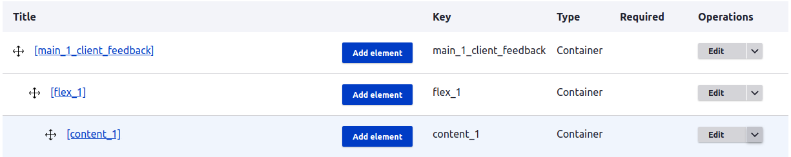
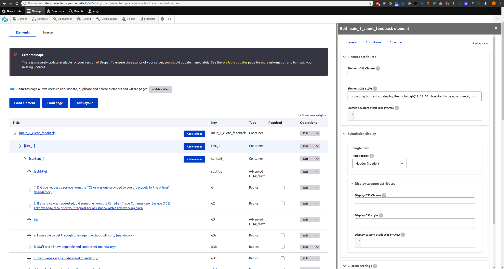

# Drupal and WebForms Help
Basic help about webforms

## Drupal and WebForms
[Drupal](https://www.google.com)

[WebForms](https://www.google.com)

Prerequistes: 
* Install Drupall (optional)

        About Drupal: . . . 
* Install "*WebForms*" module (optional)

        About Modules: . . .
* Login and navigate to:

        Administration >> Structure >> Webforms

## Creating a Form
Create
* "FLEX" Framework (locked)





```yaml
main_1_client_feedback:
  '#type': container
  '#attributes':
    style: 'box-sizing:border-box; display:flex; color:rgb(51, 51, 51); 
            font-family:Lato, sans-serif; font-size:20px; max-width:900px;'
  flex_1:
    '#type': container
    '#attributes':
      style: 'box-sizing:border-box; float:left; padding:15px;'
    content_1:
      '#type': container
      '#attributes':
        style: 'box-sizing:border-box; float:left;'
```
* Before starting  . . . . duplicate
* Create
* How to "Copy/Paste"
```yaml
main_1_client_feedback:
  '#type': container
  '#attributes':
    style: 'box-sizing:border-box; display:flex; color:rgb(51, 51, 51); 
            font-family:Lato, sans-serif; font-size:20px; max-width:900px;'
  flex_1:
    '#type': container
    '#attributes':
      style: 'box-sizing:border-box; float:left; padding:15px;'
    content_1:
      '#type': container
      '#attributes':
        style: 'box-sizing:border-box; float:left;'
```


### Adding Elements
* Before starting  . . . . duplicate

#### Element Types
* Questions to ask and choices to make . . .

##### Text Elements
* Headers

* Textbox and Textfield

        NOTE: Input masks - stuff . . .

##### Combo Elements: Checkboxes, Radios, and Pull-down
* 1
* 2
* 3 

##### 

#### Creating and Duplicating Elements

#### Duplicating Elements


#### Populating Elements
Words Words Words Words Words Words 

#### Understanding "Options", "values", "labels", and ...
Words Words Words Words Words Words 

#### Using ...
Words Words Words Words Words Words 

#### Manually ...
Words Words Words Words Words Words 

### Element Settings
Settings

### Element Styles
Styles . . . 

## Testing a Form: Is It Ready?
Before publishing . . . 

## Publishing a Form
After testing . . . 

## Form Submissions
Once published . . .

## Tips and Tricks


