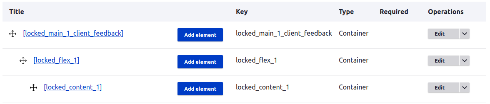
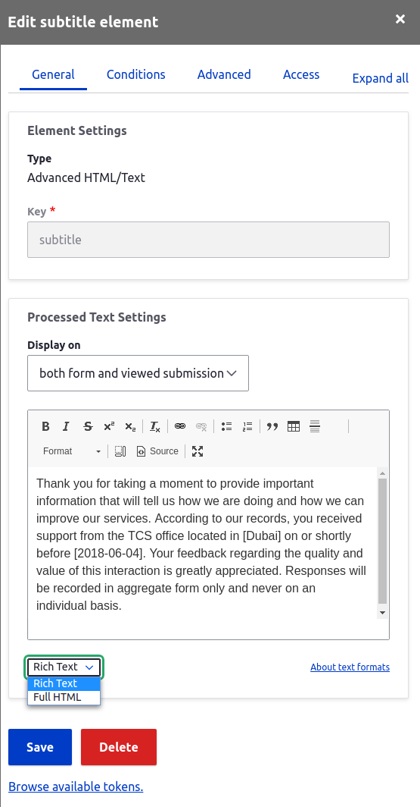
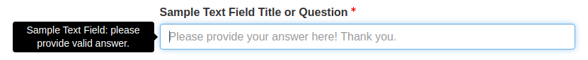
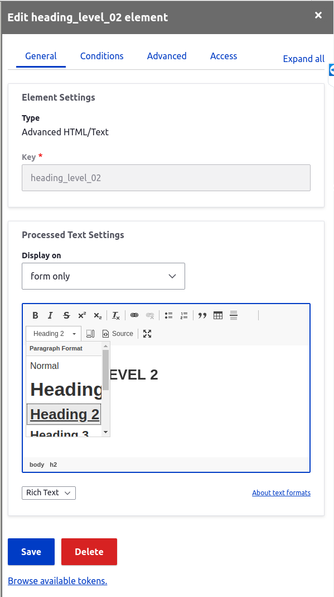

# Drupal and WebForms Help
Basic help about webforms

Session breakdowns:

Prerequisites: 

[Intro to Drupal](https://www.youtube.com/playlist?list=PLLnpHn493BHE9mfp6z5--UowO-6SOzcuI)

[What is a web form?](https://www.youtube.com/watch?v=KbbE3uC2OQE)

[Intro to Drupal Webforms](https://www.youtube.com/playlist?list=PLL73GOh1BF-mLaw_K0jruwHnAJTGuotDO)
 
 Day 1

 Day 2

 Day 3

Bug reporting to wiki


## Drupal and WebForms
[Drupal](https://www.google.com)

[WebForms](https://www.google.com)

* Install **Drupal** (optional)

      About Drupal: Drupal is a free and open-source content management framework written in PHP and distributed under the GNU General Public License. Drupal provides a back-end framework for at least 2.3% of all websites worldwide – ranging from personal blogs to corporate, political, and government sites. 

* Install **WebForms** module (optional)

      About Modules: Extend and customize Drupal functionality with contributed modules.

* Login and navigate to: 

  **Administration >> Structure >> Webform**

      About Webform: Webform is the module for making forms and surveys in Drupal. After a submission customizable e-mails can be sent to administrators and/or submitters. Results can be exported into Excel or other spreadsheet applications. Webform also provides some basic statistical review and has an extensive API for expanding its features.

## Getting Started

### Creating or duplicating a form
To create a form, click on the "+ Add Webform" botton. This will create a new form. This form will be blank. Instead of starting for scratch, select an existing form or template and select "Duplicate" from the form "Operations" pull-down. In doing so, the duplicate will include the flex framework. 

======= Provide template list

* "FLEX" Framework (locked) - the following illustrates the "flex" framework. This framework shoudl remain untouched, or "locked". All content shoudl be contained or nested within these blocks. This can ensure consistent and practical behavior across differing browsers and devices.



NOTE: A user could alternatively copy/paste the flex framewrok by selecting the "Source" tab at top of the form and simply copy and paste the code for first three blocks in a new form:

```yaml
locked_main_1_client_feedback:
  '#type': container
  '#attributes':
    style: 'box-sizing:border-box; display:flex; color:rgb(51, 51, 51); 
            font-family:Lato, sans-serif; font-size:20px; max-width:900px;'
  locked_flex_1:
    '#type': container
    '#attributes':
      style: 'box-sizing:border-box; float:left; padding:15px;'
    locked_content_1:
      '#type': container
      '#attributes':
        style: 'box-sizing:border-box; float:left;'
```

### Creating and Duplicating Elements

A user can create or duplicate elements. To add new element, click on the "Add Element" button and set its properties. Duplicating elements from an existing form is an easy way to add content to forms without needing to set element's properties. To duplicated and element, select "Duplicate" from the element "Operations" pull-down. 

#### Common Element Types
* Questions to ask and choices to make . . .

#### Populating Text Elements

* Text

  Text or processed text are used to add any **read-only** paragraph, free-form, or HTML text data to the form. To add a textbox, simply create or duplicate a textbox element. Provide a vaild and unique key and enter either rich text or HTML data into the approriate text field.

  

  Note: Please see **Element Styles** to learn more about styling text.

  It is also possible to use the form "Source" tab to copy and paste the textbox code. Take note of **"Advanced HTML/Text"** in the form editor element list or **processed_text** in the example below.

  ```yaml
  subtitle:
      '#type': processed_text
      '#text': |
        Thank you for taking a moment to provide important information that will tell us how we are doing and how we can improve our services. According to our records, you received support from the TCS office located in [Dubai] on or shortly before [2018-06-04]. Your feedback regarding the quality and value of this interaction is greatly appreciated. Responses will be recorded in aggregate form only and never on an individual basis.
  ```

* Text and textarea fields 

  Text fields are used to gather **single-line** data from the form. To add a text field, simply create or duplicate a text field element. Provide a **Title or Question** and a **Description** (rich text or HTML) into the approriate text field. It is also possible to optioally set the following: **Placeholder text** and whether the field is **required** (see example).

    
    
    Text field option sample [Text Field Options](./images/text_field_options.png)

    Textareas are much like text fields, only they allow multiline input. 

    As mentioned ealier, it is also possible to use the form "Source" tab to copy and paste the text field and textarea code. Take note of type **textfield** or **textarea**, and that the field key (e.g. the first line reading **"sample_text_field:"**) needs to have a unique name, like **"sample_text_field_01:"**.

  ```yaml
  sample_text_field:
      '#type': textfield
      '#title': 'Sample Text Field Title or Question'
      '#description': 'Sample Text Field: please provide valid answer.'
      '#placeholder': 'Please provide your answer here! Thank you.'
      '#required': true
      '#required_error': 'Valid data is required for the question. Please provide valid data.'
  ```

    NOTE: Please see **Input Masks, Conditional, and Computed Elements** to learn more about input masks (e.g. date, email, phone number, etc.)

* Headings

  Headings are a very important part of any webpage or form. Thet enable a user to easily understand and navigate the page structure and **must be included** whenver creating new content.

  ```html
  <h1></h1> -- minimun heading requirement
  <h2></h2>
  <h3></h3>
  ...
  <h6></h6> -- maximun heading requirement
  ```

  Note: The minimun requirement of **H1** is automatically created by using the **form title**. 

  To create a heading (use for page navigation and strucuture), simply create or duplicate an **Advanced HTML/Text** or **processed_text** and be be sure to include a heading class from **H2** through **H6**

  

  Note: Change the **"Rich Text"** option to **"HTML"** to enter content directly as HTML.

* Other common content types

  Links

  Images

#### Populating Combo Elements: Checkboxes, Radios, and Pull-down

The following elements offers the opportunity to select predescribed values from a list of options.

  * Checkbox selections: allows for the selection of one or more values.

  * Radio selections: allows for the selection of a single value.

  * Pull-down selections: allows for the selection of a single value.

  ##### Understanding "Options", "values", "labels", and ...
  * Option value: an option value for a  selection refers to what value is sent back to the server. This can differ from the text where text might be more descriptive. 

  * Option text: the option text for a single selection refers to what a user can see or choose from. This can be simple like "Yes/No" or more descritive "I have requested but not yet received my new security credatials."
  
  * Labels & Description: 

#### Preconfigured options and lists
Preconfigured options are reusable presets of options/values available for select menus, radio buttons, checkboxes and other elements and include **_Likert_** elements.

##### Example 1: Address setup

A good example of using a preconfigured element is when requesting an address in a form. The following is an example of an existing address configuration. 

* Missing example

##### Example 2: Scales and Likert

    A Likert scale is a rating scale, often found on survey forms, that measures how people feel about something. An effective Likert scale include a series of questions that you ask people to answer, and ideally 5-7 balanced responses people can choose from. It often comes with a neutral midpoint.

A good example of using a preconfigured element is when requesting an opinion in the form of a scale (e.g. on a scale of 1 to 10). The following is an example of an existing scaled configuration.

* Missing example

##### Example 3: Custom

A good example of a custom scale might be a language or gender selector where perhaps a new or alter comfiguration may ber required.

* Missing example

Note: To create a configuration, start with a new or duplicate an existing configuration.

#### Other Elements and Settings

While this guide has cover some of the more comon elements required in form creation, here is a short list of other elements that are common used. Find these either in existing templates or from the <a href="./images/element_list.png">element list</a>.

* Autocomplete (e.g. Country)
* Date/time?
* Email? and Email confirm?
* File? (e.g. PDF)

#### Input Masks, Conditional, and Computed Elements


### Element Styles

**Casacding Styles Sheets** class and **inline CSS** can be used at anytime. 

#### Understading Control Attributes


Styles . . . 

## Testing a Form: Is It Ready?

### Accessibility Testing

* WAVE Accessibility Checker

* Microsoft Accessibility Insights 

### Random Data Testing

## Publishing a Form
After testing . . . 

## Form Submissions
Once published . . .

## Tips, Tricks, and Reminders


## Element Types

Click here to see a list of all element types:

[All Element Types - List](./element_list.md) 

[All Element Types - With Visual Examples](./images/element_list.png)

======== Bundle a beginner training pack

======== User accounts (pantheon) 

Basic elements
*  Checkbox?
*  Hidden?
*  Textarea?
*  Text field?

Advanced elements
*  Autocomplete?
*  CAPTCHA?
*  CodeMirror?
*  Color?
*  Email?
*  Email confirm?
*  Email multiple?
*  Mapping?
*  Number?
*  Range?
*  Rating?
*  Same as…?
*  Search?
*  Signature?
*  Telephone?
*  Terms of service?
*  Text format?
*  URL?
*  Value?

Composite elements

*  Address?
*  Contact?
*  Custom composite?
*  Link?
*  Location?
*  Name?
*  Telephone advanced?

Markup elements
*  Advanced HTML/Text?
*  Basic HTML?
*  Horizontal rule?
*  Label?
*  Message?

File upload elements

*  Audio file?
*  Document file?
*  File?
*  Image file?
*  Video file?

Options elements

*  Buttons?
*  Buttons other?
*  Checkboxes?
*  Checkboxes other?
*  Likert?
*  Radios?
*  Radios other?
*  Select?
*  Select other?
*  Table select?
*  Tableselect sort?
*  Table sort?

Computed Elements
*  Computed token?
*  Computed Twig?

Containers
*  Container?
*  Details?
*  Fieldset?
*  Flexbox layout?
*  Item?
*  Section?

Date/time elements
*  Date?
*  Date/time?
*  Date list?
*  Time?

Entity reference elements
*  Entity autocomplete?
*  Entity checkboxes?
*  Entity radios?
*  Entity select?
*  Term checkboxes?
*  Term select?

Markup
*  More?

Buttons
*  Submit button(s)?

Other elements
*  Generic element? 