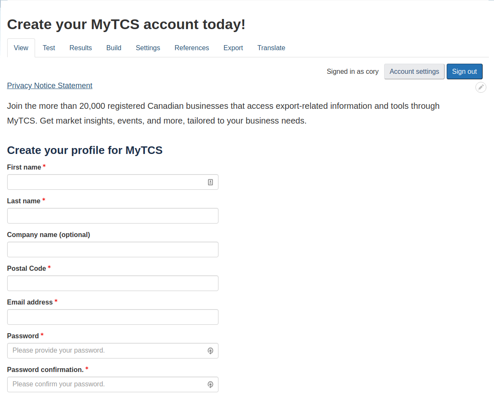

Session breakdowns:
 
 Day 1

 Day 2

 Day 3

Bug reporting to wiki

# Drupal and WebForms Help
Basic help about webforms

## Drupal and WebForms
[Drupal](https://www.google.com)

[WebForms](https://www.google.com)

Prerequistes: 
* Install Drupall (optional)

        About Drupal: Drupal is a free and open-source content management framework written in PHP and distributed under the GNU General Public License. Drupal provides a back-end framework for at least 2.3% of all websites worldwide – ranging from personal blogs to corporate, political, and government sites. 

* Install "*WebForms*" module (optional)

        About Modules: Extend and customize Drupal functionality with contributed modules.

* Login and navigate to:

        Administration >> Structure >> Webform

        About Webform: Webform is the module for making forms and surveys in Drupal. After a submission customizable e-mails can be sent to administrators and/or submitters. Results can be exported into Excel or other spreadsheet applications. Webform also provides some basic statistical review and has an extensive API for expanding its features.

## Getting Started

### Creating or duplicating a form
To create a form, click on the "+ Add Webform" botton. This will create a new form. This form will be blank. Instead of starting for scratch, select an existing form or template and select "Duplicate" from the form "Operations" pull-down. In doing so, the duplicate will include the flex framework. 

======= Provide template list

* "FLEX" Framework (locked) - the following illustrates the "flex" framework. This framework shoudl remain untouched, or "locked". All content shoudl be contained or nested within these blocks. This can ensure consistent and practical behavior across differing browsers and devices.


NOTE: A user could alternatively copy/paste the flex framewrok by selecting the "Source" tab at top of the form and simply copy and paste the code for first three blocks in a new form:

```yaml
locked_main_1_client_feedback:
  '#type': container
  '#attributes':
    style: 'box-sizing:border-box; display:flex; color:rgb(51, 51, 51); 
            font-family:Lato, sans-serif; font-size:20px; max-width:900px;'
  locked_flex_1:
    '#type': container
    '#attributes':
      style: 'box-sizing:border-box; float:left; padding:15px;'
    locked_content_1:
      '#type': container
      '#attributes':
        style: 'box-sizing:border-box; float:left;'
```

### Creating and Duplicating Elements

A user can create or duplicate elements. To add new element, click on the "Add Element" button and set its properties. Duplicating elements from an existing form is an easy way to add content to forms without needing to set element's properties. To duplicated and element, select "Duplicate" from the element "Operations" pull-down. 

#### Common Element Types
* Questions to ask and choices to make . . .

#### Populating Text Elements
* Headers

* Textboxes and Textfields

        NOTE: Input masks - stuff . . .

#### Populating Combo Elements: Checkboxes, Radios, and Pull-down
* Checkbox selections: 

* Radio selections:

* Pull-down selections:

##### Understanding "Options", "values", "labels", and ...
* Options: 
* Values: 
* Labels & Description: 

#### Preconfigured options and lists
The Options configuration page lists reusable predefined options/values available for select menus, radio buttons, checkboxes and **_Likert_** elements.

##### Example 1: Address setup

##### Example 2: Custom

##### Example 3: Scale

#### Other Elements
List of other useful elements:


### Element Styles
Styles . . . 

## Testing a Form: Is It Ready?
Before publishing . . . 

## Publishing a Form
After testing . . . 

## Form Submissions
Once published . . .

## Tips and Tricks



## Element Types

Click here to see a list of all element types: 
[All Element Types](./images/element_list.png)

======== Bundle a beginner training pack

======== User accounts (pantheon) 

Basic elements
*  Checkbox?
*  Hidden?
*  Textarea?
*  Text field?

Advanced elements
*  Type	
*  Autocomplete?
*  CAPTCHA?
*  CodeMirror?
*  Color?
*  Email?
*  Email confirm?
*  Email multiple?
*  Mapping?
*  Number?
*  Range?
*  Rating?
*  Same as…?
*  Search?
*  Signature?
*  Telephone?
*  Terms of service?
*  Text format?
*  URL?
*  Value?

Composite elements
*  Type	
*  Address?
*  Contact?
*  Custom composite?
*  Link?
*  Location?
*  Name?
*  Telephone advanced?

Markup elements
*  Type	
*  Advanced HTML/Text?
*  Basic HTML?
*  Horizontal rule?
*  Label?
*  Message?

File upload elements
*  Type	
*  Audio file?
*  Document file?
*  File?
*  Image file?
*  Video file?

Options elements
*  Type	
*  Buttons?
*  Buttons other?
*  Checkboxes?
*  Checkboxes other?
*  Likert?
*  Radios?
*  Radios other?
*  Select?
*  Select other?
*  Table select?
*  Tableselect sort?
*  Table sort?

Computed Elements
*  Type	
*  Computed token?
*  Computed Twig?
* Containers
* Type	
*  Container?
*  Details?
*  Fieldset?
*  Flexbox layout?
*  Item?
*  Section?

Date/time elements
*  Type	
*  Date?
*  Date/time?
*  Date list?
*  Time?

Entity reference elements
*  Type	
*  Entity autocomplete?
*  Entity checkboxes?
*  Entity radios?
*  Entity select?
*  Term checkboxes?
*  Term select?

Markup
*  Type	
*  More?
*  Buttons
*  Type	
*  Submit button(s)?

Other elements
*  Type	
*  Generic element?